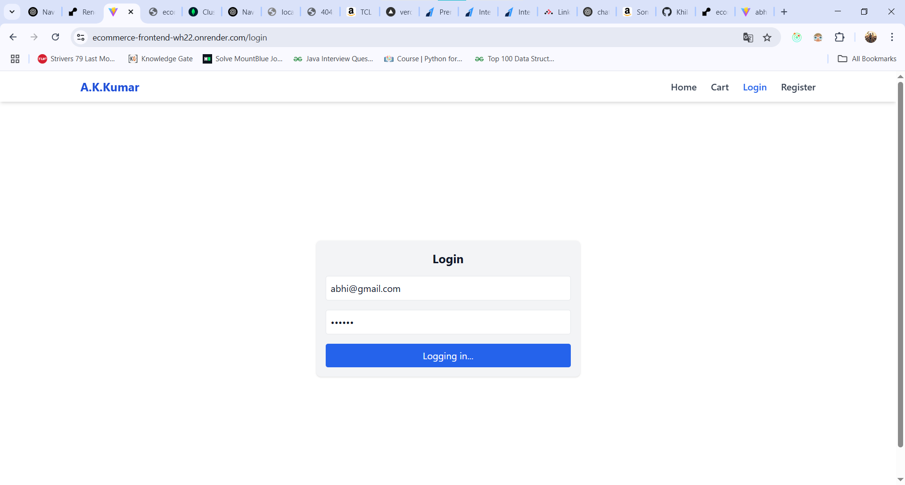
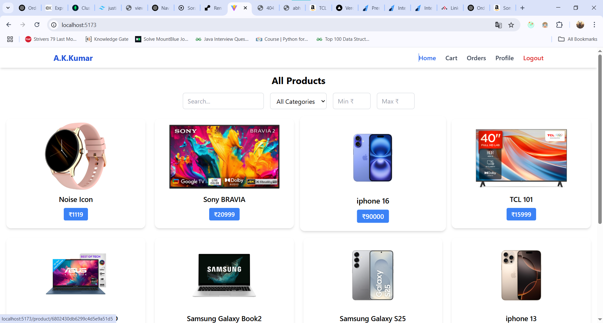
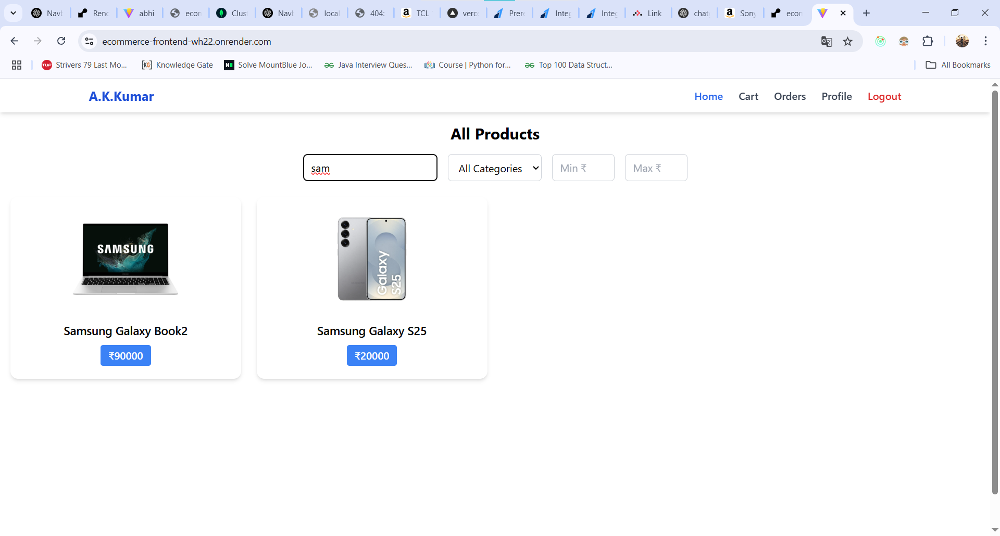
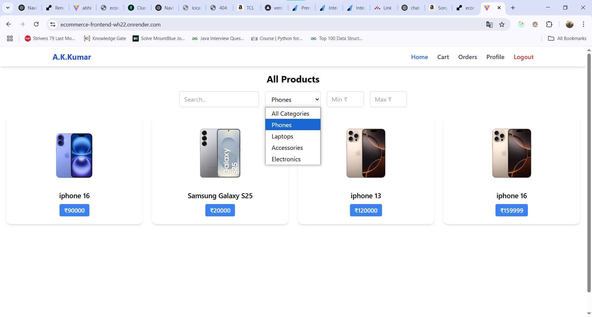
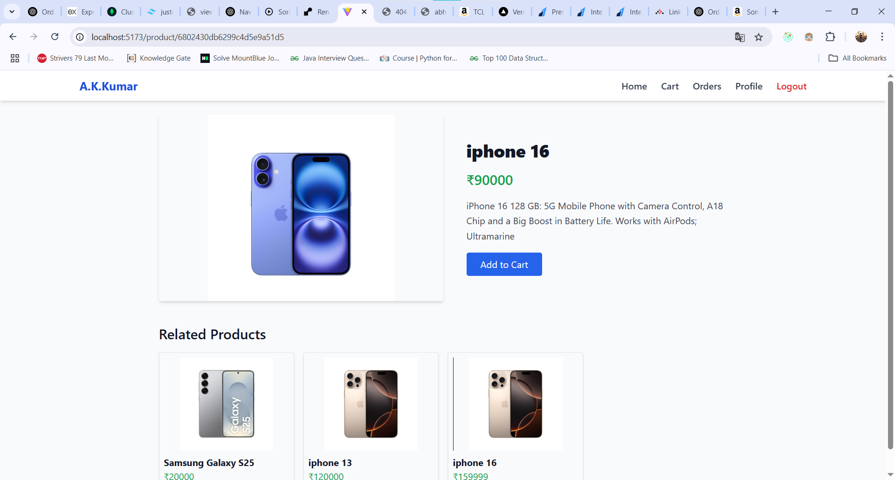
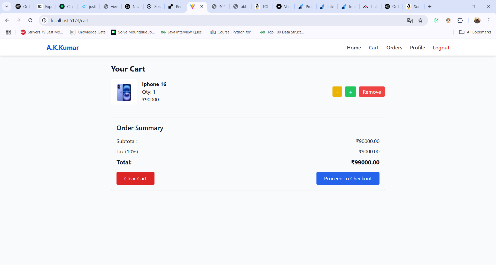
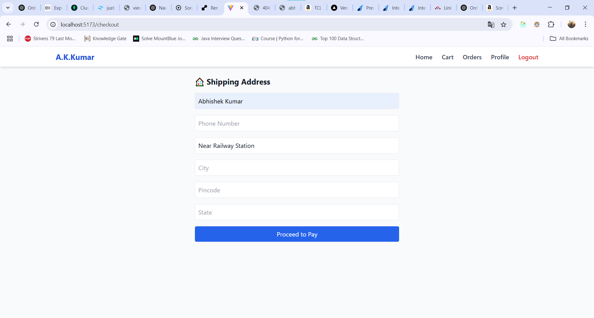
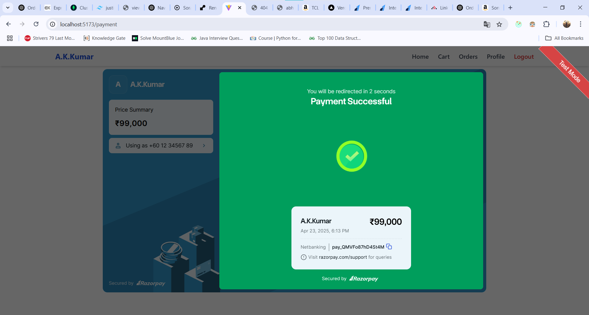
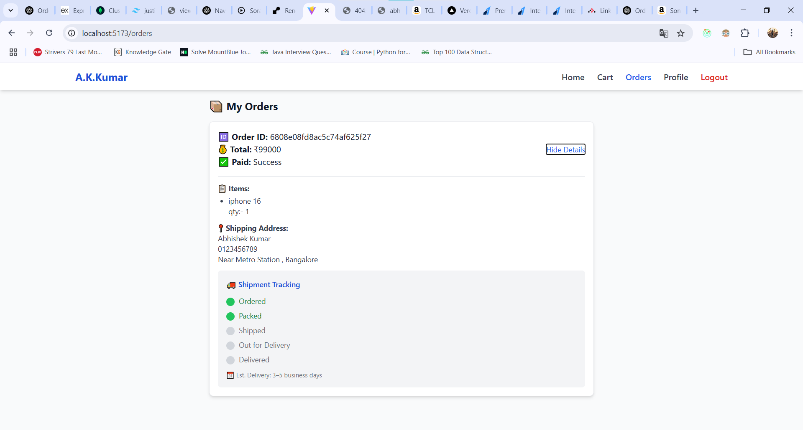
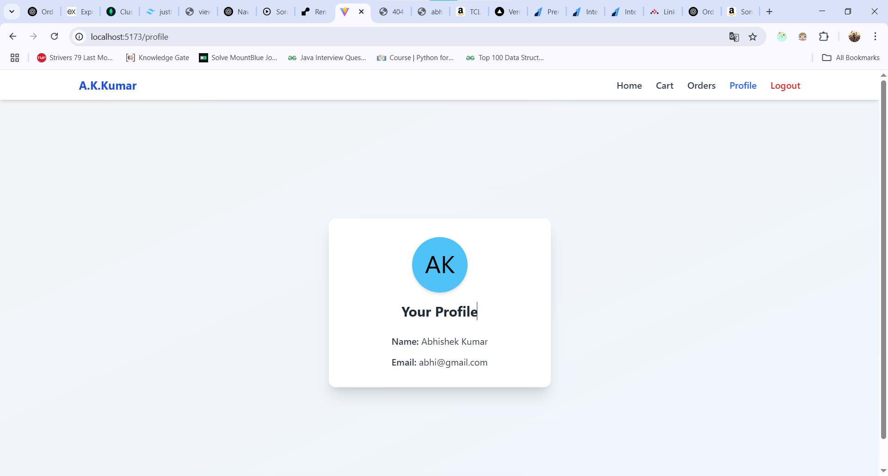

# 🛍️ E-Commerce Website

This is a modern full-stack E-Commerce application developed using React.js (Vite), Redux Toolkit, TailwindCSS for the frontend, and Node.js, Express.js, and MongoDB for the backend. It includes authentication, cart management, orders, and Razorpay integration.

---

## ⚙️ Tech Stack

**Frontend:**
- React.js (Vite)
- Redux Toolkit
- TailwindCSS
- Axios
- React Router

**Backend:**
- Node.js
- Express.js
- MongoDB
- JWT Authentication
- Razorpay Integration

---

## 🚀 Features

- 🧑‍💻 User Registration & Login (JWT-based)
- 🛒 Product Listing and Details
- 🛍️ Add to Cart / Checkout Flow
- 📦 Order Management (User & Admin)
- 💳 Razorpay Payment Integration
- 🧑‍💼 Admin Dashboard (Product CRUD)

---

## 📁 Project Structure

ecommerce-project/ ├── client/ # Frontend (React + Tailwind) ├── server/ # Backend (Express + MongoDB) └── README.md

---

## 🖼️ Screenshots

### 🔑 Login Page


### 🏠 Homepage


### 🔍 Searchpage


### ⚙️ Filterpage


### 🔐 Details Page


### 🛒 Cart Page


### 🏡 Address Page


### 💰 Payment Page


### 📦 Order Page


### 👤  Profile Page


---

## 🌐 Live Demo

👉 [Click here to view live demo](https://ecommerce-frontend-wh22.onrender.com/)

---

## 🧪 Running Locally

###  Backend Setup

```bash
cd server
npm install
npm run dev
```

### Frontend Setup
```bash
cd client
npm install
npm run dev
```
Visit: http://localhost:5173

---

### Environment Variables
Create .env files in both client/ and server/:
VITE_API_URL=http://localhost:2000

server/.env
MONGO_URI=your_mongodb_uri
JWT_SECRET=your_jwt_secret
RAZORPAY_KEY_ID=your_key_id
RAZORPAY_KEY_SECRET=your_key_secret

---

👨‍💻 Developed by
Abhishek Kumar

🔗 [Connect with me on LinkedIn](https://www.linkedin.com/in/abhishek-kumar193/)

📝 License
This project is open-source and free to use.

🙌 Thank You
Thanks for checking out this project! 😊